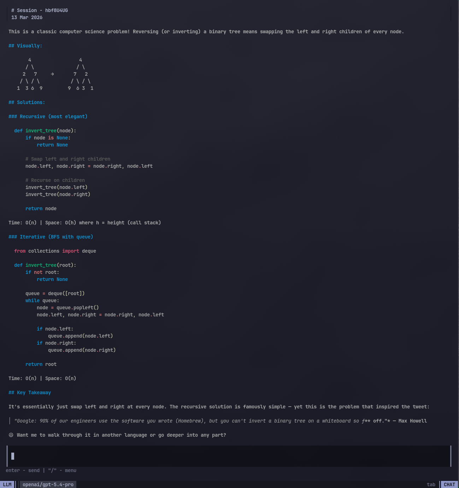

<p align="center">
  <picture>
    <source media="(prefers-color-scheme: dark)" srcset="./docs/clipt-banner-light.svg">
    <source media="(prefers-color-scheme: light)" srcset="./docs/clipt-banner-dark.svg">
    
  </picture>
</p>
<p align="center"> Chat TUI for your agents and LLMs</p>

<div style="background: #1e1e1e; border-radius: 12px; overflow: hidden; border: 0.5px solid rgba(255,255,255,0.12); display: inline-block; font-family: -apple-system, BlinkMacSystemFont, sans-serif;">
  <div style="background: #2d2d2d; padding: 12px 16px; display: flex; align-items: center; gap: 8px; border-bottom: 0.5px solid rgba(255,255,255,0.08);">
    <span style="width: 12px; height: 12px; border-radius: 50%; background: #ff5f57; display: inline-block;"></span>
    <span style="width: 12px; height: 12px; border-radius: 50%; background: #ffbd2e; display: inline-block;"></span>
    <span style="width: 12px; height: 12px; border-radius: 50%; background: #28c840; display: inline-block;"></span>
    <span style="flex: 1; text-align: center; font-size: 13px; color: rgba(255,255,255,0.5); margin-right: 36px;">my-app</span>
  </div>
  
</div>

Quickstart
---
Clip is packaged with a default SQLite storage and OpenRouter and Anthropic providers. You need to have [go installed](https://go.dev/doc/install) to run Clipt.

Depending on which provider you want want to use:

```
export OPENROUTER_API_KEY=<your-api-key>
```

Get the key from [https://openrouter.ai/](https://openrouter.ai/)

```
export ANTHROPIC_API_KEY=<your-api-key>
```

Get the key from [https://platform.claude.com/](https://platform.claude.com/)

Put this in a main.go file: 

```go
package main

import (
	"github.com/struki84/clipt"
	"github.com/struki84/clipt/providers"
	"github.com/struki84/clipt/storage"
	"github.com/struki84/clipt/tui/schema"
	"github.com/struki84/clipt/tui/style"
)

func main() {
	models := []schema.ChatProvider{}
	dbPath := "./basic.db"

	llms := []string{
		"openai/gpt-5.4-pro",
		"openai/gpt-5.4",
		"openai/gpt-5.3-chat",
		"openai/gpt-5.3-codex",
		"anthropic/claude-opus-4.6",
		"anthropic/claude-sonnet-4.6",
		"x-ai/grok-4.1-fast",
		"google/gemini-3-flash-preview",
		"deepseek/deepseek-v3.2",
	}

	sqlite := *storage.NewSQLite(dbPath)

	for _, llm := range llms {
		models = append(models, providers.NewOpenRouter(llm, sqlite))
	}

	clipt.Render(
		models,
		clipt.WithStorage(sqlite),
		clipt.WithDebugLog("debug.log"),
		clipt.WithStyle(style.Default(style.CatppuccinMocha)),
	)
}
```

Run it directly, 

```
go run main.go
```

or build a binary,

```
go build -o my_chat_app
```

and then run it.

```
./my_chat_app
```

Add the path to binary in your `$PATH` and run it as a terminal app. 


