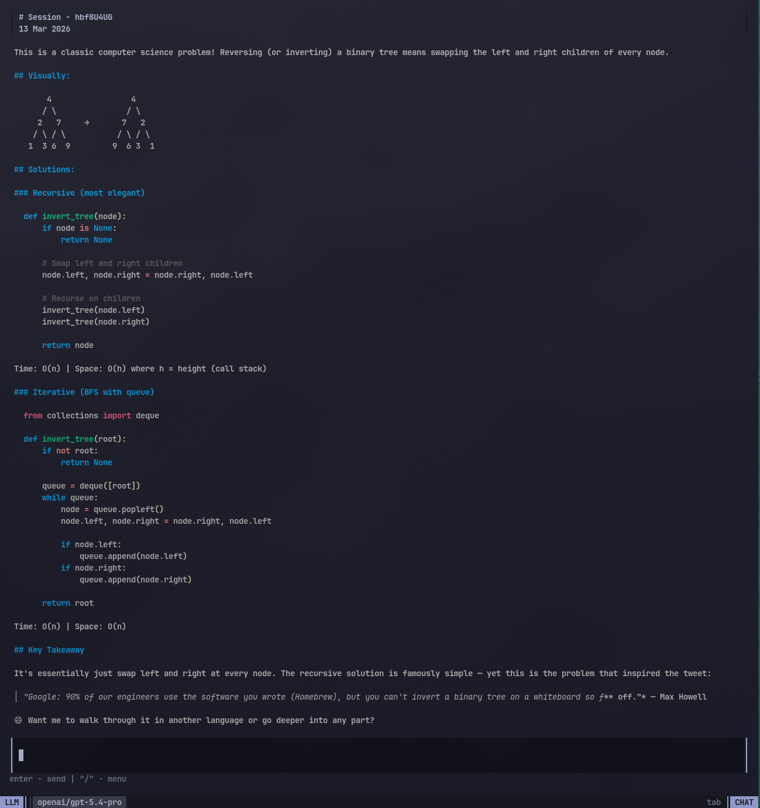

<p align="center">
  <picture>
    <source media="(prefers-color-scheme: dark)" srcset="./docs/clipt-banner-light.svg">
    <source media="(prefers-color-scheme: light)" srcset="./docs/clipt-banner-dark.svg">
    
  </picture>
</p>
<p align="center"> Chat TUI for your agents and LLMs</p>

<p align="center">
  
</p>

Quickstart
---
Clip is packaged with a default SQLite storage and OpenRouter and Anthropic providers. You need to have [go installed](https://go.dev/doc/install) to run Clipt.

Openrouter API provides quick access to a [large set of llms](https://openrouter.ai/models).

```
export OPENROUTER_API_KEY=<your-api-key>
```

Get the key from [https://openrouter.ai/](https://openrouter.ai/)

Put this in a main.go file: 

```go

package main

import (
	"github.com/struki84/clipt"
	"github.com/struki84/clipt/providers"
	"github.com/struki84/clipt/storage"
	"github.com/struki84/clipt/tui/schema"
	"github.com/struki84/clipt/tui/style"
)

func main() {
	models := []schema.ChatProvider{}
	dbPath := "./basic.db"

  // customize the list visit https://openrouter.ai/models
	llms := []string{
		"openai/gpt-5.4-pro",
		"openai/gpt-5.4",
		"openai/gpt-5.3-chat",
		"openai/gpt-5.3-codex",
		"anthropic/claude-opus-4.6",
		"anthropic/claude-sonnet-4.6",
		"x-ai/grok-4.1-fast",
		"google/gemini-3-flash-preview",
		"deepseek/deepseek-v3.2",
	}

	sqlite := *storage.NewSQLite(dbPath)

	for _, llm := range llms {
		models = append(models, providers.NewOpenRouter(llm, sqlite))
	}

	clipt.Render(
		models,
		clipt.WithStorage(sqlite),
		clipt.WithDebugLog("debug.log"),
		clipt.WithStyle(style.Default(style.CatppuccinMocha)),
	)
}
```

Run it directly, 

```
go run main.go
```

or build a binary,

```
go build -o my_chat_app
```

and then run it.

```
./my_chat_app
```

Add the path to binary in your `$PATH` and run it as a terminal app. 

# About
- chat tui built  writen in go on top of charm/bubbletea
- customizable TUI, colorscheme, and menu
- quiclky attach to any llm or a custom agent using `ChatProvider` interface 
- easily implement custom db for storing chat history using the `SessionStorage` interface
- clipt.Render options (list all?)

## Provders
- how to implement custom chat provder by using `ChatProvider` interface

```go
type ChatProvider interface {
	Name() string
	Type() ProviderType
	Description() string
	Run(ctx context.Context, input string, session ChatSession) error
	Stream(ctx context.Context, callback func(ctx context.Context, msg Msg) error)
}
```
- custom Anhropic provider  example using [langchain-go](https://github.com/tmc/langchaingo) as the client.

```go

import (
	"context"
	"fmt"
	"log"
	"time"

	"github.com/struki84/clipt/storage"
	"github.com/struki84/clipt/tui/schema"
	"github.com/tmc/langchaingo/llms"
	"github.com/tmc/langchaingo/llms/anthropic"
)

type Anthropic struct {
	LLM           *anthropic.LLM
	streamHandler func(ctx context.Context, chunk []byte) error
	currentModel  string
	storage       storage.SQLite
}

func NewAnthropic(model string, storage storage.SQLite) *Anthropic {
	llm, err := anthropic.New(anthropic.WithModel(model))
	if err != nil {
		log.Printf("can't create model: %v", err)
		return nil
	}

	return &Anthropic{
		LLM:          llm,
		currentModel: model,
		storage:      storage,
	}
}

func (model *Anthropic) Type() schema.ProviderType {
	return schema.LLM
}

func (model *Anthropic) Name() string {
	return model.currentModel
}

func (model *Anthropic) Description() string {
	desc := fmt.Sprintf("%s by Anthropic", model.currentModel)
	return desc
}

func (model *Anthropic) Stream(ctx context.Context, callback func(ctx context.Context, msg schema.Msg) error) {
	model.streamHandler = func(ctx context.Context, chunk []byte) error {
		callback(ctx, schema.Msg{
			Stream:    true,
			Role:      schema.AIMsg,
			Content:   string(chunk),
			Timestamp: time.Now().Unix(),
		})

		return nil
	}
}

func (model *Anthropic) Run(ctx context.Context, input string, session schema.ChatSession) error {
	buffer, err := model.storage.LoadMsgs(session.ID)
	if err != nil {
		log.Println(err)
		return err
	}

	userMsg := schema.Msg{
		Role:      schema.UserMsg,
		Content:   input,
		Timestamp: time.Now().Unix(),
	}

	err = model.storage.SaveMsg(session.ID, userMsg)
	if err != nil {
		log.Println(err)
		return err
	}

	content := []llms.MessageContent{
		llms.TextParts(llms.ChatMessageTypeSystem, "You are a helpful assistant!"),
		llms.TextParts(llms.ChatMessageTypeSystem, "CHAT HISTORY: \n"+buffer),
		llms.TextParts(llms.ChatMessageTypeHuman, input),
	}

	response, err := model.LLM.GenerateContent(ctx, content, llms.WithStreamingFunc(model.streamHandler))
	if err != nil {
		fmt.Println(err)
		return err
	}

	aiMsg := schema.Msg{
		Role:      schema.AIMsg,
		Content:   response.Choices[0].Content,
		Timestamp: time.Now().Unix(),
	}

	err = model.storage.SaveMsg(session.ID, aiMsg)
	if err != nil {
		log.Println(err)
		return err
	}

	return nil
}
```
## Storage
- how to implement custom session storage by using `SessionStorage` interface

```go
type SessionStorage interface {
	NewSession() (ChatSession, error)
	ListSessions() []ChatSession
	LoadRecentSession() (ChatSession, error)
	LoadSession(string) (ChatSession, error)
	SaveSession(ChatSession) (ChatSession, error)
	DeleteSession(string) error
}

type ChatSession struct {
	ID        string
	Title     string
	Msgs      []Msg
	CreatedAt int64
}
```
- check [storage/sqlite.go](https://github.com/Struki84/clipt/blob/master/storage/sqlite.go) for an example

## Styling
- there are multiple colorschemes, additionally while padding, margins, widths, and heights can be modified it might break the layout
- defualt styling is a from scratch writen and copied form early versions of opencode as an omage and inspiration.

### TUI
- lipgloss based, all styles are continaed in the `LayoutStyle` struct
- there is the default style ([tui/style/default.go](https://github.com/Struki84/clipt/blob/master/tui/style/default.go)) that can beused as a starting point for custom styling.

```go
type LayoutStyle struct {
	WhitespaceBGcolor string
	ContentView       lipgloss.Style
	InfoLine          lipgloss.Style

	StatusLine struct {
		BaseStyle    lipgloss.Style
		ProviderType lipgloss.Style
		ProviderName lipgloss.Style
		Loader       lipgloss.Style
		ModeLabel    lipgloss.Style
		ModeName     lipgloss.Style
	}

	Menu struct {
		ContentView  lipgloss.Style
		ItemNormal   lipgloss.Style
		ItemSelected lipgloss.Style
		Description  lipgloss.Style
	}

	Chat struct {
		ContentView lipgloss.Style
		Header      lipgloss.Style
		Input       lipgloss.Style

		Msg struct {
			User     lipgloss.Style
			AI       lipgloss.Style
			Sys      lipgloss.Style
			Err      lipgloss.Style
			Internal lipgloss.Style
			Glamour  ansi.StyleConfig
		}
	}
}
```

### Colorscheme

### Menu


